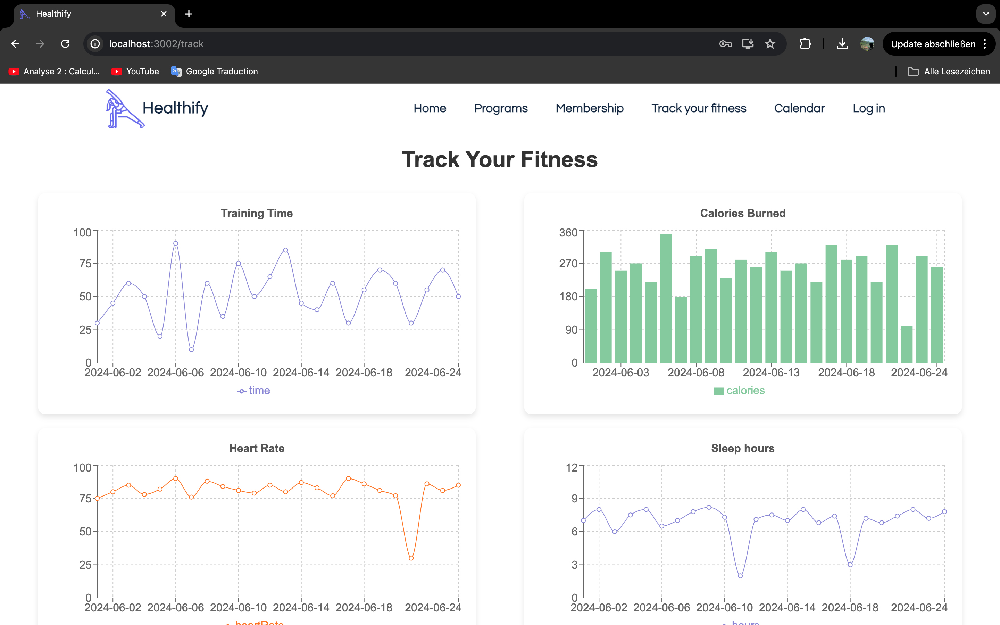

# Team 2:  
# Healthify Project ᕙ(  •̀ ᗜ •́  )ᕗ

This project is aimed at tracking fitness data and providing health insights based on user activities such as training time, calories burned, heart rate, and sleep hours.

## Installation

To run this project locally, follow these steps:

1. Clone the repository:

   ```bash
   git clone https://github.com/henrifyscher/msgHackathon
   cd healthify
   
2. Install dependencies using npm or yarn:
npm install  or yarn install
- - - 
## Packages Used: 

This project utilizes several packages for charting, PDF generation, and routing:

React - A JavaScript library for building user interfaces.
React Router DOM - Declarative routing for React.
recharts - A composable charting library for React.
jspdf - A library to generate PDFs in JavaScript.
html2canvas - JavaScript library that renders HTML to canvas.
Tailwind CSS - A utility-first CSS framework for rapidly building custom designs.
- - -
## Features
Track training time, calories burned, heart rate, and sleep hours.
Book appointments with a professional trainer.
Manage your Calender.
Display charts with historical data for each metric.
Provide health feedback based on average metrics.
Download a PDF report containing health statistics and charts to give it to your doctor.
- - -




- - -
## Demo


